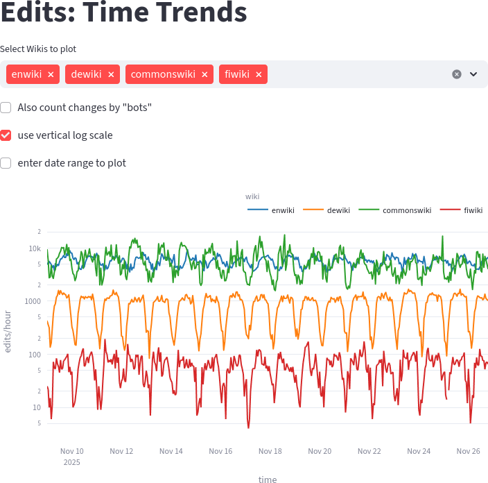
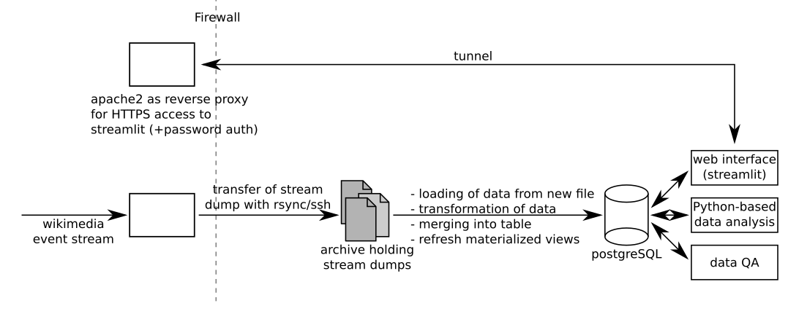

# README
Christoph Lechner, Nov 2025

**Table of Contents**
* [Summary](#summary)
* [Structure of the System](#structure-of-the-system)
* [Installation](#installation)
* [Technologies](#technologies)
* [Details](#details)

## Summary
Wikipedia is one of the largest collaborative knowledge projects in history. Every month, contributors around the world produce millions of edits. Understanding these changes (who makes them; which article is changed; ...) can be interesting for a wide range of reasons:
* Multiple edits of a page by several users: This could be either a breaking news event or a edit war.
* Curiosity: spot interesting trends in changes
* ...

The information needed to realize these applications is provided by [Wikimedia](https://www.wikimedia.org/), the organization operating the Wikipedia websites, as [data stream](https://wikitech.wikimedia.org/wiki/Event_Platform/EventStreams_HTTP_Service). Note that for privacy reasons, no stream with page views is available, however, cumulated access data (on an per-hour basis) are available [here](https://dumps.wikimedia.org/other/pageviews/2025/2025-11/).

Some selected key facts about the used data stream:
* just the meta data (not the changes themselves),
* [JSON](https://en.wikipedia.org/wiki/JSON) format, 
* average event rate of the stream is about 35 events/s (in Nov 2025), with a peak burst rate of about 90 events/s (computed for 900-second time ranges).

The received data is stored in gzip-compressed files (suitable for long-term archiving) and is loaded into an SQL database in hourly batches. There the data is available for analysis.

The following screenshot from the [streamlit-based panels](sl/) indicates the hourly edit counts for several wikis over approximately two weeks.

## Structure of the System

The data flow is as follows:
The wikimedia event stream arriving via an SSL-encrypted connection is dumped to files by the ["streamreader"](streamreader/) program running on a server system in a data center.
Resulting files are downloaded every hour via rsync/ssh to a local archive (storage on the source system is limited) and are imported/merged into the postgreSQL database using Apache Airflow [DAGs (directed acyclic graphs)](import_and_merge/airflow_dags/).
The data stored in this postgreSQL database is available for visualization by a streamlit-based interactive [plotting solution](sl/) running inside the web browser or for other applications (see [below for more details](#details)). Access to the plotting solution is provided via an HTTPS reverse proxy server running Apache version 2.4.

## Installation
The installation procedure was structured in three parts based on the [structure of the system](#structure-of-the-system):
* (1) [Data Collection](doc/INSTALL1.md)
* (2) [Data Transfer](doc/INSTALL2.md)
* (3) [Analysis](doc/INSTALL3.md)

Not in all cases all steps need to be performed. For instance, if you just want the tables to be populated, a combination of (1) and (2) might be sufficient.

For the preparation of the installation guide two virtual machines with fresh installations of Ubuntu Server 24.04.3 LTS were used.
The procedure described in the installation guide can be readily adjusted to your specific environment.

## Technologies
* OS: Ubuntu Server 24.04.3 LTS
* PostgreSQL v18
* Python 3.10 or newer
  * pytest
* Apache Airflow 3.1.3
* streamlit

## Details
For many components of the system there are resources with more details:
* [Python program](streamreader/) to store the wikimedia event stream. In my case this program is running on a separate machine (and there using a dedicated user account).
* For downloading the stored information from the wikimedia event stream:
  * Python Program for transferring the files can be found [here](https://github.com/christoph-lechner/wiki-eventstreamer-transfer)
  * Apache Airflow DAGs (directed acyclic graphs) for importing and merging the data in the files into the PostgresQL database are [here](import_and_merge/airflow_dags/)
* To visualize (or otherwise process) the information contained in the database
  * Streamlit-based plotting solution can be found [here](sl/)
  * To make this Streamlit-based plotting solution available via HTTPS, a reverse proxy using Apache2 was set up. It also does user authentication. For a few configuration details, see [here](doc/apache2_revproxy/)
  * Several Python programs using `matplotlib.pyplot` are available in [misc/](misc/)
  * The solution to monitor the freshness of the data in the table is located in a [dedicated repository](https://github.com/christoph-lechner/wiki-eventstreamer-qa-web)

To ensure reliable operation of the data collection programs, they are executed using dedicated user accounts (configured with log in disabled). The data files written by these programs are read-only accessible to selected users on the machines, in particular for the user account used to run the database loading process (see [here](doc/accounts.md) for more information).
