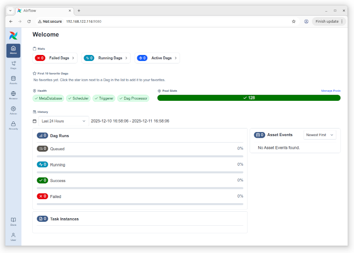
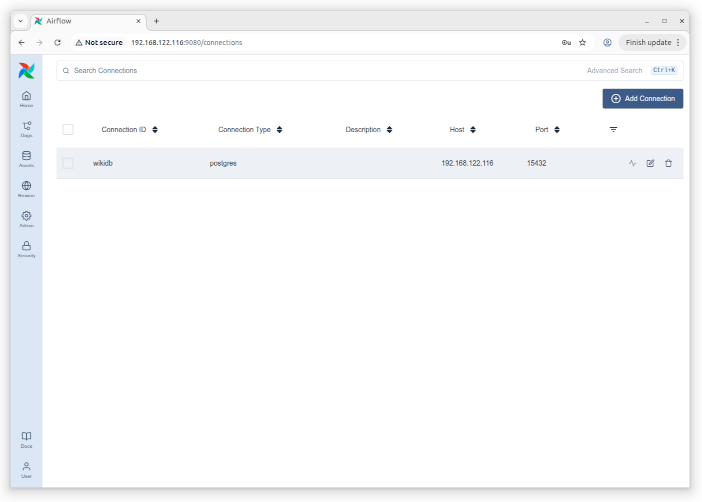
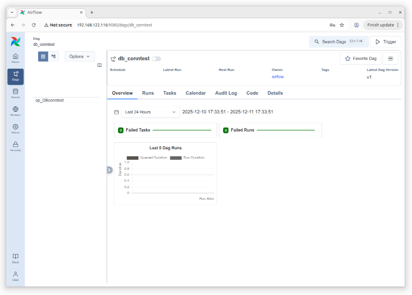
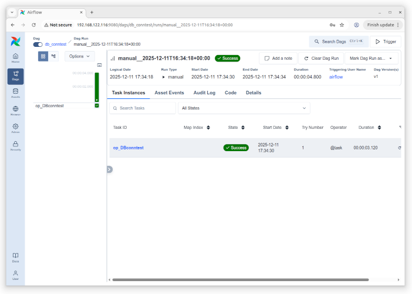
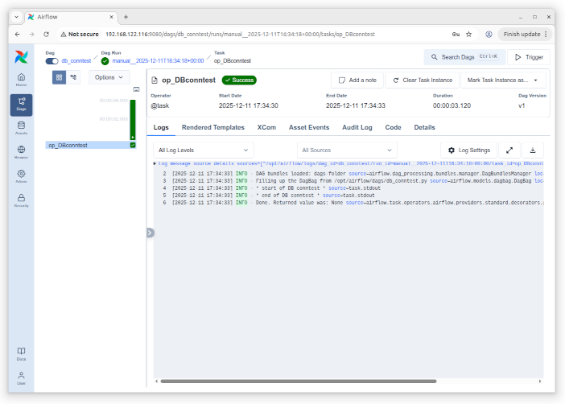
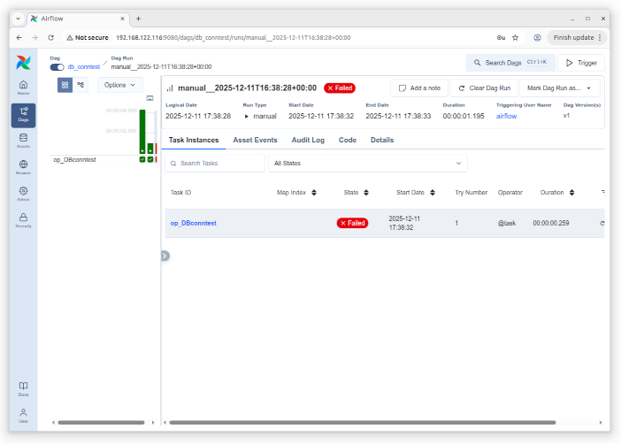
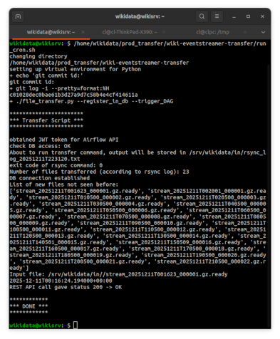
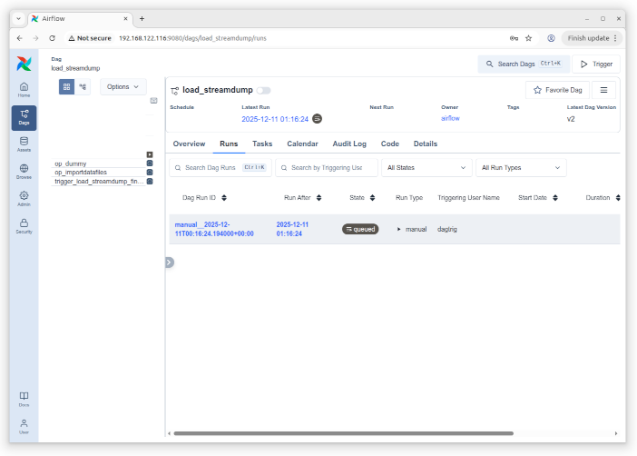
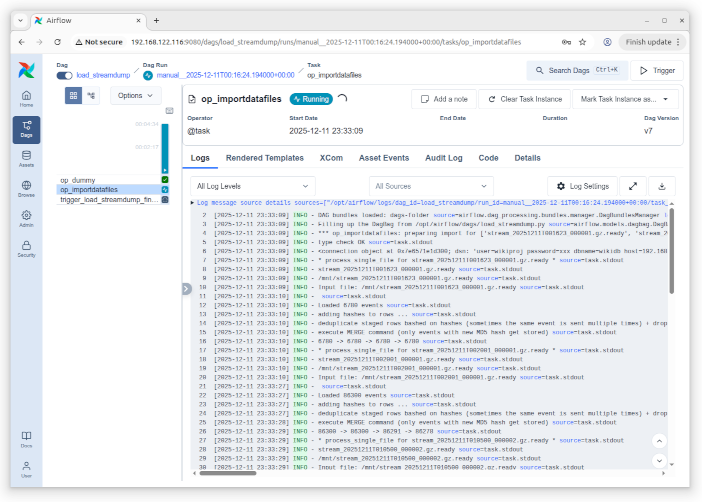

# Installation: Data Storage
Christoph Lechner, 2025-12-12

[Part 1](INSTALL1.md) -- [Part 2](INSTALL2.md) -- [Part 3](INSTALL3.md)


* 6GB RAM, 2 CPUs
* 100GB of disk (70GB for `/`, 2GB for `/boot`)
* installation with default configuration "Ubuntu Server"
* install openssh server
* hostname wikisrv

This is the most complex step of the setup procedure.
Throughout the configuration process, a few tests are described to verify that everything is working correctly.


This is the resulting TCP port configuration:
* 8080: HTTP pgadmin
* 9080: HTTP Airflow
* HTTP streamlit
* HTTP database freshness status
* 15432: postgreSQL

These ports are not SSL-/TLS-encrypted, which is a critical requirement for production use.
If you are operating with publicly visible hostnames, you might be able to use [Let's Encrypt](https://letsencrypt.org/) TLS.
However, certificate renewal might result in unneeded difficulties (on Dec 2, 2025 they decrease certificate lifetimes to 45 days.).
For postgreSQL, quick googling returned these documents:
* https://codematters.medium.com/step-by-step-guide-automatic-ssl-certificates-for-your-postgresql-f24330e486c5
* https://www.postgresql.org/docs/current/ssl-tcp.html

## Installation of Docker
Following the official installation instructions
https://docs.docker.com/engine/install/ubuntu/

Remove conflicting packages:
```
sudo apt remove $(dpkg --get-selections docker.io docker-compose docker-compose-v2 docker-doc podman-docker containerd runc | cut -f1)
```

Before we begin, let's upgrade all installed packages:
```
sudo apt-get update
sudo apt-get upgrade
```

From the docker installation instructions
```
# Add Docker's official GPG key:
sudo apt update
sudo apt install ca-certificates curl
sudo install -m 0755 -d /etc/apt/keyrings
sudo curl -fsSL https://download.docker.com/linux/ubuntu/gpg -o /etc/apt/keyrings/docker.asc
sudo chmod a+r /etc/apt/keyrings/docker.asc

# Add the repository to Apt sources:
sudo tee /etc/apt/sources.list.d/docker.sources <<EOF
Types: deb
URIs: https://download.docker.com/linux/ubuntu
Suites: $(. /etc/os-release && echo "${UBUNTU_CODENAME:-$VERSION_CODENAME}")
Components: stable
Signed-By: /etc/apt/keyrings/docker.asc
EOF

sudo apt update
```

```
sudo apt install docker-ce docker-ce-cli containerd.io docker-buildx-plugin docker-compose-plugin
```

```
cl@wikisrv:~$ sudo docker run hello-world
```

Optional:
add user to group docker to run without sudo


```
cl@wikisrv:~$ mkdir work
cl@wikisrv:~$ cd work
cl@wikisrv:~/work$ git clone https://github.com/christoph-lechner/wiki-eventstreamer.git
Cloning into 'wiki-eventstreamer'...
remote: Enumerating objects: 947, done.
remote: Counting objects: 100% (98/98), done.
remote: Compressing objects: 100% (71/71), done.
remote: Total 947 (delta 40), reused 74 (delta 27), pack-reused 849 (from 1)
Receiving objects: 100% (947/947), 1.95 MiB | 6.16 MiB/s, done.
Resolving deltas: 100% (533/533), done.
cl@wikisrv:~/work$
```

## Preparation of Users
```
cl@wikisrv:~$ sudo useradd -m -c "user for wiki data storage" -s /bin/bash wikidata
cl@wikisrv:~$ sudo useradd -m -c "user for wiki proj" -s /bin/bash wikiproj
cl@wikisrv:~$ sudo useradd -m -c "user for wiki proj DB" -s /bin/bash wikipg
```
```
cl@wikisrv:~$ id wikidata
uid=1001(wikidata) gid=1001(wikidata) groups=1001(wikidata)
cl@wikisrv:~$ id wikiproj
uid=1002(wikiproj) gid=1002(wikiproj) groups=1002(wikiproj)
cl@wikisrv:~$ id wikipg
uid=1003(wikipg) gid=1003(wikipg) groups=1003(wikipg)
```


## Preparation of PostgreSQL DB
```
cl@wikisrv:~$ sudo mkdir /srv/postgres-data-wiki
cl@wikisrv:~$ sudo chown wikipg:wikipg /srv/postgres-data-wiki/
```

**Modification of docker-compose.yaml file for the DB to run with this user**
```
cl@wikisrv:~/work/wiki-eventstreamer/db$ id wikipg
uid=1003(wikipg) gid=1003(wikipg) groups=1003(wikipg)
```

**DB config: git commit ID ac71132**

The default passwords for postgres and pgadmin need to be changed. Note that the default password for postgres in docker-compose.yaml is only effective for the first time when the DB is initialized.


```
postgres@127.0.0.1:postgres> CREATE USER wikiproj WITH PASSWORD 'your_password';
CREATE ROLE
Time: 0.023s
postgres@127.0.0.1:postgres> CREATE DATABASE wikidb OWNER wikidb;
role "wikidb" does not exist
Time: 0.026s
postgres@127.0.0.1:postgres> CREATE DATABASE wikidb OWNER wikiproj;
CREATE DATABASE
Time: 0.114s
postgres@127.0.0.1:postgres>
```
Verify that we can connect as `wikiproj` to the `wikidb` and that we can create a simple table there (and insert a row).

```
postgres@127.0.0.1:postgres> CREATE USER wikiproj_ro WITH PASSWORD 'your_ro_password';
CREATE ROLE
Time: 0.023s
postgres@127.0.0.1:postgres> GRANT CONNECT ON DATABASE wikidb TO wikiproj_ro;
GRANT
Time: 0.016s
postgres@127.0.0.1:postgres> \c wikidb
You are now connected to database "wikidb" as user "postgres"
Time: 0.075s
postgres@127.0.0.1:wikidb> GRANT USAGE ON SCHEMA public TO wikiproj_ro;
GRANT
Time: 0.015s
postgres@127.0.0.1:wikidb> GRANT SELECT ON ALL TABLES IN SCHEMA public TO wikiproj_ro;
GRANT
Time: 0.016s
postgres@127.0.0.1:wikidb>
```
Above commands granted SELECT permission to `wikiproj_ro` on all tables that are already existing in database `wikidb`. What is still missing is adjusting the permissions for tables that will be created in the future.
As `wikiproj` will be creating all the tables in the database `wikidb`, the following command must be executed as user `wikiproj` (**not as superuser 'postgres'**):
```
wikiproj@127.0.0.1:wikidb> ALTER DEFAULT PRIVILEGES IN SCHEMA public GRANT SELECT ON 
 TABLES TO wikiproj_ro;
You're about to run a destructive command.
Do you want to proceed? [y/N]: y
Your call!
ALTER DEFAULT PRIVILEGES
Time: 0.020s
wikiproj@127.0.0.1:wikidb>
```

### Database Schema
The database schema can be found in [schema.sql] (schema.sql).

Apply it to generate the table structures in the newly created database.

## Preparation of Apache Airflow
Note that, as pointed out in [the Airflow documentation](https://airflow.apache.org/docs/apache-airflow/stable/howto/docker-compose/index.html), **this setup is not suitable for production use). inspecting the UID/GID inside the containers, the processes appear to be running with group ID 0.**

### Changes to docker-compose.yaml
Thi directory `import_and-merge/docker-conf/` contains the `docker-compose.yaml` file that can be used to get Airflow running in Docker.
It is based on the file from the Airflow documentation, with a few changes to adopt it to this specific setup. In particular, this includes changes to mount the directory with the production data files (`/srv/wikidata/in`) to `/mnt` inside of the containers.

The additional GID of 1001 is `wikidata`, it is required to have read-only access to data files. Adjust it to match the GID in your setup.

Following the notes in `import_and_merge/docker-conf/README.md`

### Setting up the directory
```
cl@wikisrv:~$ sudo mkdir /srv/airflow
cl@wikisrv:~$ sudo chown wikiproj:wikiproj /srv/airflow
cl@wikisrv:~$ sudo -i
root@wikisrv:~# su - wikiproj
wikiproj@wikisrv:~$ cd /srv/airflow
wikiproj@wikisrv:/srv/airflow$
```

### Preparing the environment
As in the [the Airflow documentation](https://airflow.apache.org/docs/apache-airflow/stable/howto/docker-compose/index.html):
```
wikiproj@wikisrv:/srv/airflow$ mkdir -p ./dags ./logs ./plugins ./config
wikiproj@wikisrv:/srv/airflow$ echo -e "AIRFLOW_UID=$(id -u)" > .env
```
Set up your password:
```
wikiproj@wikisrv:/srv/airflow$ chmod 600 .env
wikiproj@wikisrv:/srv/airflow$ echo -e "_AIRFLOW_WWW_USER_PASSWORD='Your_Password'" >> .env
```

`docker-compose.yaml` file from 8cb796c

Before running any docker command, this directory should now look like:
```
wikiproj@wikisrv:/srv/airflow$ ls -la
total 44
drwxr-xr-x 6 wikiproj wikiproj  4096 Dec 11 15:54 .
drwxr-xr-x 6 root     root      4096 Dec 11 14:55 ..
drwxrwxr-x 2 wikiproj wikiproj  4096 Dec 11 15:54 config
drwxrwxr-x 2 wikiproj wikiproj  4096 Dec 11 15:54 dags
-rw-rw-r-- 1 wikiproj wikiproj 12944 Dec 11 15:53 docker-compose.yaml
-rw------- 1 wikiproj wikiproj    60 Dec 11 15:43 .env
drwxrwxr-x 2 wikiproj wikiproj  4096 Dec 11 15:54 logs
drwxrwxr-x 2 wikiproj wikiproj  4096 Dec 11 15:54 plugins
wikiproj@wikisrv:/srv/airflow$
```

### ONLY THE FIRST TIME: Initialize the database
```
cl@wikisrv:/srv/airflow$ sudo docker compose up airflow-init
```
Warning:
```
airflow-init-1  | The container is run as root user. For security, consider using a regular user account.
```
Many messages pop up in the terminal, and finally you see:
```
airflow-init-1 exited with code 0
```

### Starting Airflow
```
cl@wikisrv:/srv/airflow$ sudo docker compose up -d
```

In my setup, this takes approx. 2 minutes.

Open the web browser and log in using user `airflow` and the password from the `.env` file. **Note that as this connection is not encrypted, the password and all further information that is entered could be eavesdropped.** 


We arrive at the start screen.



Especially the list of DAGs is still empty:


### Adding the DAGs
Let's add the DAGs for this project.

First of all pack the needed files into a tar archive.
```
cl@wikisrv:~/work/wiki-eventstreamer/import_and_merge/airflow_dags$ tar -cf /tmp/airflow_dags.tar .
```

Drop the DAGs into the correct place and check the configuration (file from git commit id ac71132):
```
wikiproj@wikisrv:/srv/airflow/dags$ tar -xf /tmp/airflow_dags.tar
wikiproj@wikisrv:/srv/airflow/dags$ cat load_streamdump_cfg.py
from pathlib import Path

def get_cfg():
    cfg = {
        # data directory seen from INSIDE of the Docker container
        'DATADIR': Path('/mnt/'),
        'DB_CONN_ID': 'wikidb',
    }
    return cfg
wikiproj@wikisrv:/srv/airflow/dags$ ls -l
total 24
-rw-rw-r-- 1 wikiproj wikiproj 1703 Dec 11 12:30 filedb_util.py
-rw-rw-r-- 1 wikiproj wikiproj  206 Dec 11 15:59 load_streamdump_cfg.py
-rw-rw-r-- 1 wikiproj wikiproj 1359 Dec 11 12:30 load_streamdump_finalize.py
-rw-rw-r-- 1 wikiproj wikiproj 3670 Dec 11 12:30 load_streamdump.py
-rw-rw-r-- 1 wikiproj wikiproj 6276 Dec 11 12:30 wikiloader.py
wikiproj@wikisrv:/srv/airflow/dags$
```

Airflow periodically scans the directories, so after some time Airflow should list them under the menu point DAGs.


### Set up the DB connection
The value of `DB_CONN_ID` is the ID of the connection that needs to be defined in Airflow.
In the menu on the left side:
Admin -> Connections
On the top-right "Add Connection".
Enter the name `wikidb` and select connection type "Postgres" (it can take a few seconds until the list in the drop-down menu is prepared).
Again, because we are connected to Airflow via HTTP (and not via HTTPS), all data we enter here could be eavesdropped!




This is the only connection needed, in particular no file-system-related connections need to be set up as the current version of the script (as of 2025-Dec) assumes that everything is running on the local filesystem.

### Adjusting the permissions of the data directory
At the data directory was not existing and but was defined as volume in the `docker-compose.yaml` file of Airflow, it was created with owner `root`.

This needs to be adjusted:
```
cl@wikisrv:~$ sudo chown wikidata:wikidata /srv/wikidata/in
cl@wikisrv:~$ sudo chmod 750 /srv/wikidata/in
cl@wikisrv:~$ ls -ld /srv/wikidata/in
drwxr-x--- 2 wikidata wikidata 4096 Dec 11 14:55 /srv/wikidata/in
cl@wikisrv:~$
```

### Optional: Checking the permission structure for file access
For the data ingestion process to work, it is crucial that the files containing the stream dumps can be accessed from within the Airflow containers.

For this check, let's identify the container running the worker:
```
CONTAINER ID   IMAGE                  COMMAND                  CREATED         STATUS                            PORTS                                              NAMES
5b9002effb13   apache/airflow:3.1.3   "/usr/bin/dumb-init …"   2 minutes ago   Up 6 seconds (health: starting)   8080/tcp                                           airflow-airflow-worker-1
[..]
```

To check the directory mapping: drop a file and then launch a shell inside of one of the running containers
```
cl@wikisrv:/srv/airflow$ sudo touch /srv/wikidata/in/hallo
cl@wikisrv:/srv/airflow$ sudo docker exec -it airflow-airflow-worker-1 /bin/bash
default@5b9002effb13:/opt/airflow$ id
uid=1002(default) gid=0(root) groups=0(root),1001
default@5b9002effb13:/opt/airflow$ ls -l /mnt/
total 0
-rw-r--r-- 1 root root 0 Dec 11 15:37 hallo
default@5b9002effb13:/opt/airflow$
```
As expected, the file that was placed on the host in directory `/srv/wikidata/in` appears inside the container in the path `/mnt` and there is permission to enter the directory.

### Database Connection Test
To check the DB connection without launching any importer DAGs, a new DAG `db_conntest.py` was created while writing this installation guide.
It was dropped into the directory `/srv/airflow/dags`.



You can manually trigger the DAG


and inspect the log to see that everything worked.





To demonstrate what happens if the DB connection does not work, I changed the password in the configuration definition, and then the triggered DAG run fails.




### Setting up Airflow account for DAG Run Triggering via HTTP
```
cl@wikisrv:/srv/airflow$ sudo docker compose exec airflow-scheduler airflow users create --username dagtrig --firstname dagtrig --lastname dagtrig --role User -e "dagtrig@dagtrig"
[..]
User "dagtrig" created with role "User"
```

### Optional: Trigger DAG Run via HTTP
We manually perform all steps needed to trigger a DAG Run via HTTP. The same steps are also carried out by the [transfer program](https://github.com/christoph-lechner/wiki-eventstreamer-transfer) that will be installed in the following.

We follow [https://airflow.apache.org/docs/apache-airflow/stable/security/api.html](https://airflow.apache.org/docs/apache-airflow/stable/security/api.html).
These credentials are now used to obtain a JWT token that will be used for authentication:
```
cl@wikisrv:/srv/airflow$ curl -X POST http://localhost:9080/auth/token \
  -H "Content-Type: application/json" \
  -d '{
    "username": "dagtrig",
    "password": "your_password"
  }'
{"access_token":"..."}
```
This token is valid only for a limited time (in my installation about 24 hours) and thus has to be obtained briefly before the actual REST API calls.

Let's trigger a DAG run next.
```
cl@wikisrv:/srv/airflow$ curl -X POST http://localhost:9080/api/v2/dags/db_conntest/dagRuns \
  -H "Content-Type: application/json" \
  -H "Authorization: Bearer <JWT_TOKEN>" \
  -d '{ "logical_date": "2025-12-11T21:00:00Z" }'
{"dag_run_id":"manual__2025-12-11T21:00:00+00:00","dag_id":"db_conntest","logical_date":"2025-12-11T21:00:00Z","queued_at":"2025-12-11T20:43:39.796346Z","start_date":null,"end_date":null,"duration":null,"data_interval_start":"2025-12-11T21:00:00Z","data_interval_end":"2025-12-11T21:00:00Z","run_after":"2025-12-11T21:00:00Z","last_scheduling_decision":null,"run_type":"manual","state":"queued","triggered_by":"rest_api","triggering_user_name":"dagtrig","conf":{},"note":null,"dag_versions":[{"id":"019b0e3e-ad6a-7870-9642-20edede61078","version_number":1,"dag_id":"db_conntest","bundle_name":"dags-folder","bundle_version":null,"created_at":"2025-12-11T16:29:07.306413Z","dag_display_name":"db_conntest","bundle_url":null}],"bundle_version":null,"dag_display_name":"db_conntest"}cl@wikisrv:/srv/airflow$
```
This worked, the DAG run has been queued (the `logical_date` is in the future):


## Setting up SSH login with public key auth.
As I do not have a DNS entry for the virtual machine writing the event stream into files, I added it to the `/etc/hosts` file.

This will be needed for automatic transfer of the stored data.

**TODO/FIXME: The described procedure needs to be carried out for wikidata@wikisrv**

### ONLY IF NEEDED: prepare public key
This may be needed on the machine that is going to download the files via ssh/rsync, i.e. the machine in the internal network.
**Do not run this if you already have the keys!**

```
cl@wikisrv:~$ XX_ssh-keygen # remove the leading "XX_" if you are sure that you wish to generate the keys
Generating public/private ed25519 key pair.
Enter file in which to save the key (/home/cl/.ssh/id_ed25519): 
Enter passphrase (empty for no passphrase): 
Enter same passphrase again: 
Your identification has been saved in /home/cl/.ssh/id_ed25519
Your public key has been saved in /home/cl/.ssh/id_ed25519.pub
The key fingerprint is:
SHA256:[redacted] cl@wikisrv
The key's randomart image is:
+--[ED25519 256]--+
[..]
+----[SHA256]-----+
cl@wikisrv:~$
```

### Transfer public key to target account
Since password-based log in is disabled for `dataxfer`, the following manual workaround is used (**we display here the public key; under no circumstances must the private key be revealed**):
```
cl@wikisrv:~/.ssh$ cat id_ed25519.pub 
ssh-ed25519 [.. redacted ..] cl@wikisrv
```

We connect to the machine running the streamdumper (as positive side-effect we store also the host key of the other system):
```
cl@wikisrv:~$ ssh cl@wikiacq
The authenticity of host 'wikiacq (192.168.122.100)' can't be established.
ED25519 key fingerprint is SHA256:[redacted].
This key is not known by any other names.
Are you sure you want to continue connecting (yes/no/[fingerprint])? yes
Warning: Permanently added 'wikiacq' (ED25519) to the list of known hosts.
cl@wikiacq's password: 
Welcome to Ubuntu 24.04.3 LTS (GNU/Linux 6.8.0-88-generic x86_64)
[..]
cl@wikiacq:~$ sudo -i
[sudo] password for cl: 
root@wikiacq:~# su - dataxfer
```
The `authorized_keys` file does not exist yet. If it is already existing this normally means that one can login using this account. Then the manual procedure described here should not be used as corrupting the `authorized_keys` file can result in being locked out of the account.
```
dataxfer@wikiacq:~$ cd .ssh
-bash: cd: .ssh: No such file or directory
dataxfer@wikiacq:~$ mkdir .ssh
dataxfer@wikiacq:~$ cd .ssh
dataxfer@wikiacq:~/.ssh$ vim authorized_keys

Add the line to the file exactly as formated above.

dataxfer@wikiacq:~/.ssh$ chmod 600 authorized_keys 
```

Let's try to log in using public key auth. If it works, you should get the prompt as `dataxfer@wikiacq` without being prompted for any passwords (remember that password-based login is disabled for this account):
```
cl@wikisrv:~$ ssh dataxfer@wikiacq
Welcome to Ubuntu 24.04.3 LTS (GNU/Linux 6.8.0-88-generic x86_64)

[..]

dataxfer@wikiacq:~$ 
logout
Connection to wikiacq closed.
cl@wikisrv:~$
```

## Prepare Data Transfer Script
Before we can continue, we have to install the package needed for Python3 virtual environments:
```
cl@wikisrv:~$ sudo apt-get install python3-venv
```

Now we can create the virtual environment
```
wikidata@wikisrv:~$ mkdir prod_transfer
wikidata@wikisrv:~$ cd prod_transfer/
wikidata@wikisrv:~/prod_transfer$ mkdir venv_prod
wikidata@wikisrv:~/prod_transfer$ python3 -m venv /home/wikidata/prod_transfer/venv_prod/
wikidata@wikisrv:~/prod_transfer$ source /home/wikidata/prod_transfer/venv_prod/bin/activate
(venv_prod) wikidata@wikisrv:~/prod_transfer$
```

Clone the git repository (at the time of this writing the git commit id was e8cbeea, date: 2025-12-12; this commit includes minor changes made while writing this text)
```
(venv_prod) wikidata@wikisrv:~/prod_transfer$ git clone https://github.com/christoph-lechner/wiki-eventstreamer-transfer.git
[..]
```

Install the needed Python packages:
```
(venv_prod) wikidata@wikisrv:~/prod_transfer/wiki-eventstreamer-transfer$ pip3 install -r requirements.txt 
```

Now, let's store the username/password needed to trigger the DAG run via HTTP:
```
(venv_prod) wikidata@wikisrv:~$ mkdir ~/.wikidb
(venv_prod) wikidata@wikisrv:~$ cd ~/.wikidb
(venv_prod) wikidata@wikisrv:~/.wikidb$ vim transfer_auth
(venv_prod) wikidata@wikisrv:~/.wikidb$ chmod 600 transfer_auth 
(venv_prod) wikidata@wikisrv:~/.wikidb$ ls -l
total 4
-rw------- 1 wikidata wikidata 76 Dec 11 21:47 transfer_auth
(venv_prod) wikidata@wikisrv:~/.wikidb$ cat transfer_auth 
export WIKIDB_AIRFLOW_USER=dagtrig
export WIKIDB_AIRFLOW_PWD=your_password
(venv_prod) wikidata@wikisrv:~/.wikidb$
```

Let's use the test program to obtain a JWT token. If it works this means that authentication is working:
```
(venv_prod) wikidata@wikisrv:~/prod_transfer/wiki-eventstreamer-transfer$ . ~/.wikidb/transfer_auth
(venv_prod) wikidata@wikisrv:~/prod_transfer/wiki-eventstreamer-transfer$ ./obtain_JWT.py 
Test: Trying to obtain JWT token from server
That worked, this means that your username/password are correct
Obtained token: eyJ ... B0w
(venv_prod) wikidata@wikisrv:~/prod_transfer/wiki-eventstreamer-transfer$
```

At the top of script `file_transfer.py`, a few configuration changes are needed:
* `dir_staging` (this is the local destination directory for the transfer)
* `xfer_source` (remote source of the data transfer in `scp` syntax)
* `db_host`/`db_port`/`db_name`/`db_user` for accessing the postgreSQL database

From `file_transfer.py`:
```
####################
### BEGIN CONFIG ###

dir_staging = '/srv/wikidata/in/'
xfer_source = 'dataxfer@wikiacq:/srv/wikiproj/streamdata_in/'

db_host= '192.168.122.116'
db_port = 15432
db_name = 'wikidb'
# password from ~/.pgpass file (!mode 0600, otherwise file is ignored!)
db_user = 'wikiproj'

# see also airflow_api.py for Airflow API config

###  END CONFIG  ###
####################
```

The password for the postgreSQL database is stored in `~/.pgpass` (set mode 0600, otherwise the file is silently ignored!). This is the contents of the `~/.pgpass` file of user `wikidata@wikisrv`.
```
192.168.122.116:15432:wikidb:wikiproj:your_password
```

Let's run the program (without triggering the DAG runs)
```
(venv_prod) wikidata@wikisrv:~/prod_transfer/wiki-eventstreamer-transfer$ ./file_transfer.py --register_in_db

***********************
*** Transfer Script ***
***********************

obtained JWT token for Airflow API
check DB access: OK
About to run transfer command, output will be stored in /srv/wikidata/in/rsync_log_20251211T221431.txt
exit code of rsync command: 0
Number of files transferred (according to rsync log): 23
DB connection established
List of new files not seen before:
['stream_20251211T001623_000001.gz.ready', 'stream_20251211T002001_000001.gz.ready', 'stream_20251211T010500_000002.gz.ready', 'stream_20251211T020500_000003.gz.ready', 'stream_20251211T030500_000004.gz.ready', 'stream_20251211T040500_000005.gz.ready', 'stream_20251211T050500_000006.gz.ready', 'stream_20251211T060500_000007.gz.ready', 'stream_20251211T070500_000008.gz.ready', 'stream_20251211T080500_000009.gz.ready', 'stream_20251211T090500_000010.gz.ready', 'stream_20251211T100500_000011.gz.ready', 'stream_20251211T110500_000012.gz.ready', 'stream_20251211T120500_000013.gz.ready', 'stream_20251211T130500_000014.gz.ready', 'stream_20251211T140501_000015.gz.ready', 'stream_20251211T150509_000016.gz.ready', 'stream_20251211T160500_000017.gz.ready', 'stream_20251211T170500_000018.gz.ready', 'stream_20251211T180500_000019.gz.ready', 'stream_20251211T190500_000020.gz.ready', 'stream_20251211T200500_000021.gz.ready', 'stream_20251211T210500_000022.gz.ready']
triggering DAG was not requested

************
*** DONE ***
************

(venv_prod) wikidata@wikisrv:~/prod_transfer/wiki-eventstreamer-transfer$ 
```

The files should have been registered in the database. This is necessary for the DAGs to correctly perform the import, therefore we have a look into the database to verify that the files listed in above output are also stored in the table:
```
wikiproj@127.0.0.1:wikidb> SELECT filename FROM wiki_datafiles ORDER BY filename ASC;
 
+----------------------------------------+
| filename                               |
|----------------------------------------|
| stream_20251211T001623_000001.gz.ready |
| stream_20251211T002001_000001.gz.ready |
| stream_20251211T010500_000002.gz.ready |
| stream_20251211T020500_000003.gz.ready |
| stream_20251211T030500_000004.gz.ready |
| stream_20251211T040500_000005.gz.ready |
| stream_20251211T050500_000006.gz.ready |
| stream_20251211T060500_000007.gz.ready |
| stream_20251211T070500_000008.gz.ready |
| stream_20251211T080500_000009.gz.ready |
| stream_20251211T090500_000010.gz.ready |
| stream_20251211T100500_000011.gz.ready |
| stream_20251211T110500_000012.gz.ready |
| stream_20251211T120500_000013.gz.ready |
| stream_20251211T130500_000014.gz.ready |
| stream_20251211T140501_000015.gz.ready |
| stream_20251211T150509_000016.gz.ready |
| stream_20251211T160500_000017.gz.ready |
| stream_20251211T170500_000018.gz.ready |
| stream_20251211T180500_000019.gz.ready |
| stream_20251211T190500_000020.gz.ready |
| stream_20251211T200500_000021.gz.ready |
| stream_20251211T210500_000022.gz.ready |
+----------------------------------------+
SELECT 23
Time: 0.021s
wikiproj@127.0.0.1:wikidb>
```
That worked.

### Preparation for First Transfer with Import
Before we can actually trigger the first import into the database, we need to wipe out any knowledge of these files. **THIS MUST ONLY BE DONE NOW WHILE SETTING THINGS UP!**

```
wikiproj@127.0.0.1:wikidb> TRUNCATE wiki_datafiles;
You're about to run a destructive command.
Do you want to proceed? [y/N]: y
Your call!
TRUNCATE TABLE
Time: 0.013s
wikiproj@127.0.0.1:wikidb>
```

```
(venv_prod) wikidata@wikisrv:~/prod_transfer/wiki-eventstreamer-transfer$ mkdir xx
(venv_prod) wikidata@wikisrv:~/prod_transfer/wiki-eventstreamer-transfer$ mv /srv/wikidata/in/rsync_log_20251211T221* ./xx/
(venv_prod) wikidata@wikisrv:~/prod_transfer/wiki-eventstreamer-transfer$ mv /srv/wikidata/in/stream_20251211T*ready ./xx/
(venv_prod) wikidata@wikisrv:~/prod_transfer/wiki-eventstreamer-transfer$ ls -l /srv/wikidata/in/
total 0
-rw-r--r-- 1 root root 0 Dec 11 15:37 hallo
(venv_prod) wikidata@wikisrv:~/prod_transfer/wiki-eventstreamer-transfer$ rm -rf ./xx/
(venv_prod) wikidata@wikisrv:~/prod_transfer/wiki-eventstreamer-transfer$
```

### First Transfer with Import
Manually we run the first transfer triggering import into the database.

We switch off the Python virtual environment
```
(venv_prod) wikidata@wikisrv:~$ deactivate
```
and launch the script that will later be executed as cronjob. If this executes correctly, we can be confident that everything is set up correctly for the regular data import. As in the `crontab`, we run the script with absolute path:
```
/home/wikidata/prod_transfer/wiki-eventstreamer-transfer/run_cron.sh
```





Exploring the DAG run (the very first time, the DAG run is triggered, it needs to be manually "switched on") by
* clicking on the run
* then on `op_importdatafiles`
* then the log becomes visible (here stdout/stderr is collected)



The total run time of this import process was about 10 minutes.

### Configuring Cronjob
Our goal is to run this data transfer at minute 10 of every hour.
To achieve this, we need to configure a so-called cronjob.
We run the command: 
```
wikidata@wikisrv:~$ crontab -e
```
The line to be added at the very bottom of the file is:
```
10 * * * * /usr/bin/flock -n /tmp/wiki-transfer-cron.lockfile /home/wikidata/prod_transfer/wiki-eventstreamer-transfer/run_cron.sh
```
In the editor, save the file and exit. On the terminal you should now see
```
crontab: installing new crontab
wikidata@wikisrv:~$
```
The new `crontab` was installed (you can check by running `crontab -l`).


Shortly after minute 10 of the next hour, a new DAG run should become visible in Apache Airflow.
