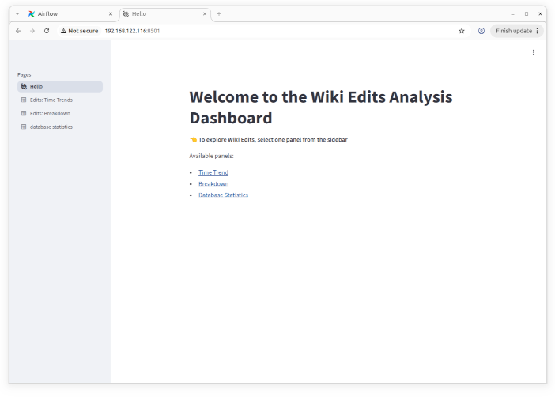
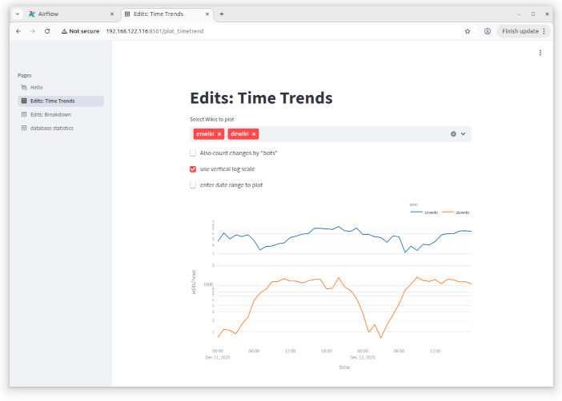

# Installation: Data Analysis
Christoph Lechner, 2025-12-12

**Navigation:** [Part 1](INSTALL1.md) -- [Part 2](INSTALL2.md) -- [Part 3](INSTALL3.md)

## streamlit-based Dashboard
The source code pages can be found in [this git repository](../sl/app/).

```
cl@wikisrv:~$ mkdir sl
cl@wikisrv:~$ cd sl
cl@wikisrv:~/sl$ git clone https://github.com/christoph-lechner/wiki-eventstreamer.git
Cloning into 'wiki-eventstreamer'...
remote: Enumerating objects: 1096, done.
remote: Counting objects: 100% (247/247), done.
remote: Compressing objects: 100% (176/176), done.
remote: Total 1096 (delta 112), reused 194 (delta 70), pack-reused 849 (from 1)
Receiving objects: 100% (1096/1096), 4.64 MiB | 6.29 MiB/s, done.
Resolving deltas: 100% (605/605), done.
cl@wikisrv:~/sl$ cd wiki-eventstreamer/
cl@wikisrv:~/sl/wiki-eventstreamer$ cd sl
cl@wikisrv:~/sl/wiki-eventstreamer/sl$
```

File versions as in commit id `2303143`.

Based on the template `.env.template`, create the file `.env`. As this file holds sensitive information (credentials for database access), be sure to set the mode to 0600.

For the first test we run it in foreground. The command also performs the preparation of the Docker image, if needed:
```
sudo docker compose up
```

If everything worked as expected, this streamlit instance can be reached via HTTP protocol on the default port 8501. There is no authentication configured.



