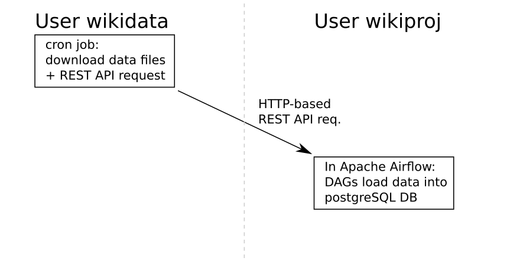
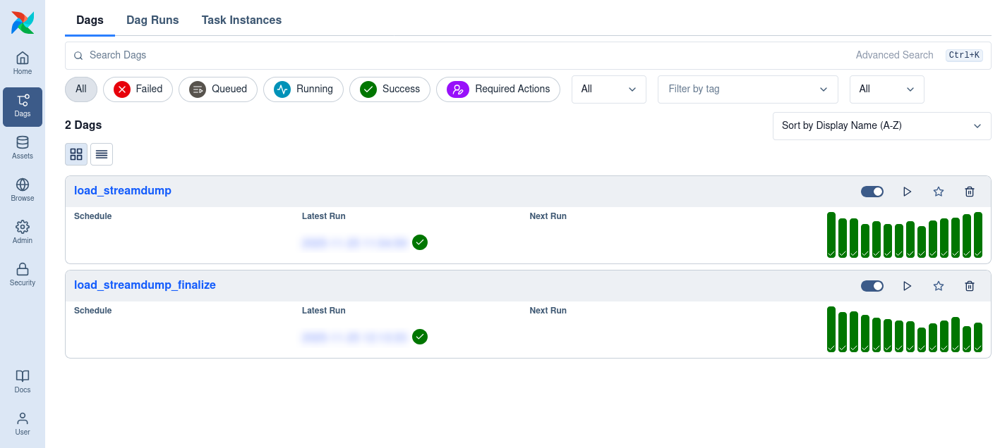

# README
## List of Resources
This directory contains the following resources:
* Version 1 (now historic) of the import-and-merge scripts
* [The DAGs for Apache Airflow version 3.1.3](airflow_dags/). They were developed with the Airflow version 3.1.3 executed using a [modified version](docker-conf/) of a `docker-compose.yaml` file provided by the Airflow project for learning and exploration. In this setup, these file are to be placed into the `dags/` directory (at least this configuration does not support the import from Python modules when they are in a subdirectory of `dags/`).

## Implementation with Airflow
In combination with the transfer script running as traditional cronjob,
a few Airflow DAGs are used to load the data in the data table.



Once the most recent files with stream dumps have been downloading to the local data directory, the Airflow DAGs are triggered via a REST API request (internally this is a HTTP POST request). This API request also "crosses" between different Linux users, since the cronjob for data downloads runs with a different user id (this user is also owner of the data files).

### cronjob Configuration Detail
The cronjob for data transfer is currently configured to run at minute 10 of every hour as follows:
```
wikidata@clsrv:~$ crontab -l
[..]

10 * * * * /usr/bin/flock -n /tmp/wiki-transfer-cron.lockfile /home/wikidata/prod_transfer/wiki-eventstreamer-transfer/run_cron.sh
```
The `flock` command ([manpage](https://man7.org/linux/man-pages/man1/flock.1.html)) ensures that at most one instance of the transfer program is running. As the transfer process has a normal runtime of about 1 minute, this is only a protection in the case of malfunction.

### Airflow DAGs
The following picture is a screenshot taken in the browser-based Airflow user interface, showing the two DAGs set up for this process:



The DAG `load_streamdump` reads the file containing the stream dump; loads it into a temporary table in the postgreSQL database; performs necessary type transformations; performs deduplications (in very rare occasions the event stream contains the same event multiple times); and 

The DAG `load_streamdump_finalize` triggers the update process for two 'materialized views' (postgreSQL-specific extension).

In the moment these operations are performed using Python code. Adding a dedicated tool such as [dbt](https://getdbt.com/) for these operations seems not to be justified because of the additional operational and maintenance complexity it would introduce.
