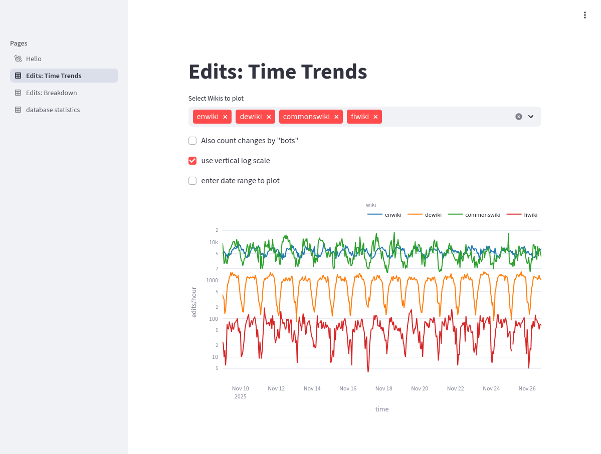
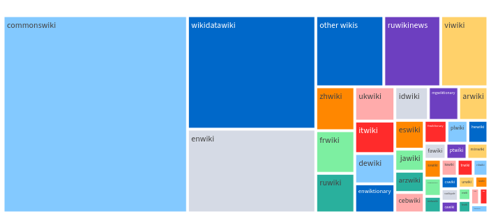

# Streamlit App
This directory contains a simple [streamlit](https://streamlit.io/) application generating interactive plots. The Python source code behind the application can be found in the `app/` subdirectory.

The data indicated in the plots is retrieved from the postgreSQL database according to the user's input.

## Interactive Plots
Currently, the Streamlit Application provides two interactive panels.

Additional panels will be added in the future that will enable deeper exploration of the event data being collected in the database.

The panels use the wiki names as delivered in the event stream. 
These are close but not identical to the wiki names in the list of wiki projects [available at Wikimedia](https://meta.wikimedia.org/wiki/List_of_Wikimedia_projects_by_size) (there exists also an [interactive version](https://wikistats.wmcloud.org/wikimedias_html.php)). For instance, the German Wikipedia is listed on the Streamlit panels as `dewiki`, while those pages list it as `de.wikipedia`.

### Time Trends

From the drop-down menu, select the wikis of interest.

Optionally, the user can provide a date range to plot.

Furthermore, the following plotting options are available:
* Include also changes by programs identifying themselves as ["bots"](https://en.wikipedia.org/wiki/Wikipedia:Bots)
* Logarithmic vertical axis. This is useful when plotting wikis having very different event rates. In the screenshot, the peak edits/hour in the English Wikipedia are about an order of magnitude higher than the German Wikipedia and about two orders of magnitude higher than the Finnish Wikipedia.

### Wiki Breakdown

This panel indicates are breakdown of total event counts for different Wikis.
A checkbox controls if edits by ["bots"](https://en.wikipedia.org/wiki/Wikipedia:Bots) should be included into the counts.

The Wikis having only small individual event counts are combined into one segment ('other wikis'), totaling 5 percent of overall events.
